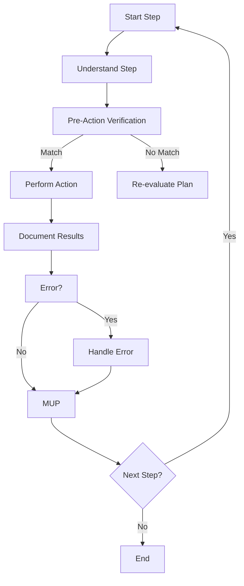

# **Cline Recursive Chain-of-Thought System (CRCT) - Execution Plugin**

**This Plugin provides detailed instructions and procedures for the Execution phase of the CRCT system. It should be used in conjunction with the Core System Prompt.**

---

## I. Entering and Exiting Execution Phase

**Entering Execution Phase:**

1. **`.clinerules` Check**: Always read `.clinerules` first. If `[LAST_ACTION_STATE]` shows `current_phase: "Execution"`, proceed with these instructions.

2. **Transition from Strategy**: Enter after Strategy; `.clinerules` `next_phase` will be "Execution".

3. **User Trigger**: Start a new session post-Strategy or to resume execution.

**Exiting Execution Phase:**

1. **Completion Criteria**:

- All steps in the instruction file(s) are executed.

- Expected outputs are generated.

- Results and observations are documented.

- MUP is followed for all actions.

2. **`.clinerules` Update (MUP)**:

- To return to Strategy:

        ```
        last_action: "Completed Execution Phase - Tasks Executed"
        current_phase: "Execution"
        next_action: "Phase Complete - User Action Required"
        next_phase: "Strategy"
        ```

    -   For project completion:

        ```
        last_action: "Completed Execution Phase - Project Objectives Achieved"
        current_phase: "Execution"
        next_action: "Project Completion - User Review"
        next_phase: "Project Complete"
        ```

*Note: "Project Complete" pauses the system; define further actions if needed.*

3. **User Action**: After updating `.clinerules`, pause for user to trigger the next phase. See Core System Prompt, Section III for a phase transition checklist.

---

## II. Loading Context for Execution

**Action**: Load context for task execution.

**Procedure**:

- Load core files: `.clinerules`, `projectbrief.md`, `productContext.md`, `activeContext.md`, `dependency_tracker.md`, `changelog.md`, `doc_tracker.md`.

- Review `activeContext.md` for project state and priorities.

- Check trackers (`dependency_tracker.md`, `doc_tracker.md`, mini-trackers) for dependencies.

- Load instruction file (`{task_name}_instructions.txt` or `{module_dir}/{module_dir}_main_instructions.txt`), focusing on "Objective," "Context," "Dependencies," and "Steps".

- Load dependency files using hierarchical keys from trackers.

---

## III. Executing Tasks from Instruction Files

**Action**: Execute the step-by-step plan in the instruction file.

**Procedure**:
1.  **Iterate Through Steps**:
    -   **Understand the Step**: Clarify the action required.
    -   **Pre-Action Verification (MANDATORY)**: Before file modifications (`replace_in_file`, `write_to_file`, etc.):
        -   Re-read target file with `read_file`.
        -   Generate "Pre-Action Verification" Chain-of-Thought:
            1.  **Intended Change**: State the change (e.g., "Replace line X with line Y in file Z").
            2.  **Expected Current State**: Describe expected state (e.g., "Line X is A").
            3.  **Actual Current State**: Note actual state from `read_file` (e.g., "Line X is B").
            4.  **Validation**: Compare; proceed if matching, otherwise re-evaluate.
        -   Example:

            ```
            1. Intended Change: Replace line 10 with "process_data()" in `utils/data_utils.py`.
            2. Expected Current State: Line 10 is "clean_data()".
            3. Actual Current State: Line 10 is "clean_data()".
            4. Validation: Match confirmed; proceed.
            ```

    -   **Perform Action**: Execute the step (e.g., `write_to_file`).
    -   **Document Results (Mini-CoT)**: Record outcomes and insights.
    -   **MUP**: Follow Core MUP and Section IV additions after each step.
2.  **Error Handling**:
    -   Document error message and context.
    -   Diagnose cause using recent actions and state.
    -   Resolve by revising steps, dependencies, or seeking clarification.
    -   Record resolution or next steps.
    -   Apply MUP post-resolution.
3.  **Incremental Execution**: Execute steps sequentially, verifying, acting, and documenting.

### III.4 Execution Flowchart



---

## IV. Execution Plugin - MUP Additions

After Core MUP steps:

1. **Update Instruction File**: Save modifications (e.g., notes), avoiding major "Steps" changes unless critical.

2. **Update Mini-Trackers**: Reflect new dependencies with `set_char`:

* If new dependencies have been created, use `suggest-dependencies` with the appropriate tracker type, and then use `set_char` to add the dependency to the grid.

- Example:

```
python -m cline_utils.dependency_system.dependency_processor suggest-dependencies --tracker {module_dir}/{module_dir}_main_instructions.txt --tracker_type mini
```

```
python -m cline_utils.dependency_system.dependency_processor set_char --index  --new_char  --output {module_dir}/{module_dir}_main_instructions.txt --key 
```

3. **Update `.clinerules` [LAST_ACTION_STATE]**:

- After a step: Set `last_action` to step completed, `next_action` to next step or "Instruction File Complete".

- After all steps:

```
---CLINE_RULES_START---
[LAST_ACTION_STATE]
last_action: "Completed all steps in task_x_instructions.txt"
current_phase: "Execution"
next_action: "Phase Complete - User Action Required"
next_phase: "Strategy"
[LEARNING_JOURNAL]
# ...
---CLINE_RULES_END---
```

---

## V. Quick Reference

-   **Actions**:
    -   Execute steps: Follow instruction file steps.
    -   Verify actions: Perform pre-action checks.
-   **Files**:
    -   Instruction files: Contain execution steps.
    -   `activeContext.md`: Tracks execution state.
    -   Mini-trackers: Reflect new dependencies.
-   **MUP Additions**: Update instruction files, mini-trackers, and `.clinerules`.

## VI. Error Handling and Performance Optimization

### VI.1 Error Handling

When encountering errors with dependency tracking commands:

1. **File not found errors**: Verify paths are correct and exist in the file system.

2. **Grid validation errors**: Verify the tracker structure. You may need to use `generate-keys` to re-initialize the tracker if it's severely corrupted, or use `remove-file` and `suggest-dependencies`/`set_char` to correct individual entries. Ensure that any keys referenced in `set_char` exist in the tracker.

3. **Embedding errors**: If you encounter errors related to embeddings, ensure the embeddings have been generated using `generate-embeddings` before attempting to use `suggest-dependencies`.

### VI.2 Performance Optimization

For large projects:
**Embeddings**: Generate embeddings before suggesting dependencies for better results:

```
python -m cline_utils.dependency_system.dependency_processor generate-embeddings --root_paths  --output  --model all-MiniLM-L6-v2
```
