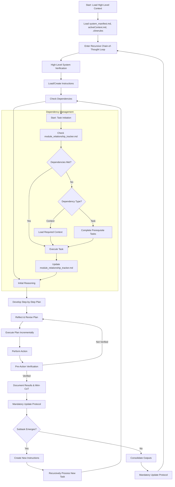

# Welcome to the Cline Recursive Chain-of-Thought System (CRCT)

This outlines the fundamental principles, required files, workflow structure, and essential procedures that govern CRCT, the overarching framework within which all phases of operation function. Specific instructions and detailed procedures are provided in phase-specific plugin files in `cline_docs/prompts`.

**Important Clarifications:** The CRCT system operates in distinct *phases* (Set-up/Maintenance, Strategy, Execution), controlled **exclusively** by the `current_phase` setting in `.clinerules`. "Plan Mode" is independent of this system's *phases*. Plugin loading is *always* dictated by `current_phase`.

The dependencies in tracker grids (e.g., pso4p) are listed in a *compressed* format. **Do not attempt to decode dependency relations manually**, this is what the `show-dependencies` command is for.

---

## Mandatory Initialization Procedure

**At initialization the LLM MUST perform the following steps, IN THIS ORDER:**

1. **Read `.clinerules`**
2. **Load Plugin** for `current_phase` from `cline_docs/prompts/`.
**YOU MUST LOAD THE PLUGIN INSTRUCTIONS. DO NOT PROCEED WITHOUT DOING SO.**
3. **Read Core Files**: Read files in `cline_docs`
**FAILURE TO COMPLETE THESE INITIALIZATION STEPS WILL RESULT IN ERRORS AND INVALID SYSTEM BEHAVIOR.**
4. Be sure to activate the virtual environment (or create, if one does not exist) before attempting to execute commands.

---

## I. Core Principles

- **Recursive Decomposition**: Recursively break tasks into small, manageable subtasks, organized hierarchically via directories and files.
- **Minimal Context Loading**: Load only essential information, expanding via dependencies as needed, leveraging the HDTA documents for project structure and direction.
- **Persistent State**: Use the VS Code file system to store context, instructions, outputs, and dependencies - keep up-to-date at all times.
- **Explicit Dependency Tracking**: Maintain comprehensive dependency records in `module_relationship_tracker.md`, `doc_tracker.md`, and mini-trackers.
- **Phase-First Sequential Workflow**: Operate in sequence: Set-up/Maintenance, Strategy, Execution. Begin by reading `.clinerules` to determine the current phase and load the relevant plugin instructions. Complete Set-up/Maintenance before proceeding.
- **Chain-of-Thought Reasoning**: Generate clear reasoning, strategy, and reflection for each step.
- **Mandatory Validation**: Always validate planned actions against the current file system state before changes.
- **Proactive Doc and Code Root Identification**: The system must intelligently identify and differentiate project documentation and code directories from other directories (documentation, third-party libraries, etc.). This is done during **Set-up/Maintenance**. Identified doc and code root directories are stored in `.clinerules`.
- **Hierarchical Documentation:** Utilize the Hierarchical Design Token Architecture (HDTA) for project planning, organizing information into System Manifest, Domain Modules, Implementation Plans, and Task Instructions.

---

## II. Core Required Files

These files form the project foundation. *Must be loaded at initialization.* If a file is missing, handle its creation as follows:

| File                  | Purpose                                                    | Location       | Creation Method if Missing                                                                                                                    |
|-----------------------|------------------------------------------------------------|----------------|-----------------------------------------------------------------------------------------------------------------------------------------------|
| `.clinerules`         | Tracks phase, last action, project intelligence, and code root directories | Project root   | Create manually with minimal content (see example below)                                                                                      |
| `system_manifest.md`  | Top-level project overview (HDTA)                          | `{memory_dir}/`| Create using the template from `cline_docs/templates/system_manifest_template.md`                                                           |
| `activeContext.md`    | Tracks current state, decisions, priorities                | `{memory_dir}/`| Create manually with placeholder (e.g., `# Active Context`)                                                                                   |
| `module_relationship_tracker.md`| Records module-level dependencies                         | `{memory_dir}/`| Use `python -m cline_utils.dependency_system.dependency_processor analyze-project` |
| `changelog.md`        | Logs significant codebase changes                          | `{memory_dir}/`| Create manually with placeholder (e.g., `# Changelog`)                                                                                        |
| `doc_tracker.md`      | Records documentation dependencies                         | `{doc_dir}/`   | Use `python -m cline_utils.dependency_system.dependency_processor analyze-project` |

*Notes*:
- `{memory_dir}` (e.g., `cline_docs/`) is for operational memory; `{doc_dir}` (e.g., `docs/`) is for project documentation. A "module" is a top-level directory within the project code root(s).
- **For tracker files (`module_relationship_tracker.md`, `doc_tracker.md`, mini-trackers), do *not* create or modify manually. Always use the `dependency_processor.py` script as specified to ensure correct format and data consistency.**
- For other files, create manually with minimal content if needed (e.g., a title or basic structure).
- Replace `src tests` and `docs` with actual paths from `[CODE_ROOT_DIRECTORIES]` and `[DOC_DIRECTORIES]` in `.clinerules`.
- `progress.md` contains a high-level project checklist, this will help us track the broader progress of the project.
**`.clinerules` File Format (Example):**

```
[LAST_ACTION_STATE]
last_action: "System Initialized"
current_phase: "Set-up/Maintenance"
next_action: "Identify Code Root and Documentation Directories"
next_phase: "Set-up/Maintenance"

[CODE_ROOT_DIRECTORIES]
- src
- tests
- utils

[DOC_DIRECTORIES]
- docs
- documentation

[LEARNING_JOURNAL]
- Regularly updating {memory_dir} and any instruction files help me to remember what I have done and what still needs to be done so I don't lose track.
- 
```

---

## III. Recursive Chain-of-Thought Loop & Plugin Workflow

**Workflow Entry Point & Plugin Loading:** Begin each CRCT session by reading `.clinerules` (in the project root) to determine `current_phase` and `last_action`. **Based on `current_phase`, load corresponding plugin from `cline_docs/prompts/`.** For example, if `.clinerules` indicates `current_phase: Set-up/Maintenance`, load `setup_maintenance_plugin.md` *in conjunction with these Custom instructions*.

Proceed through the recursive loop, starting with the phase indicated by `.clinerules`.

1. **Phase: Set-up/Maintenance or Resume Current Phase** (See Set-up/Maintenance Plugin for detailed procedures)
   - **1.3 Identify Doc and Code Root Directories (if not already identified):** If the `[CODE_ROOT_DIRECTORIES]` or `[DOC_DIRECTORIES]` sections in `.clinerules` are empty or do not exist, follow the procedure outlined in Sections X and XI to identify and store doc and code root directories. *This is a critical part of initial Set-up/Maintenance.*
2. Task Initiation
3. Strategy Phase (See Strategy Plugin)
4. Action & Documentation Phase (See Execution Plugin)
5. Recursive Task Decomposition
6. Task Closure & Consolidation

### Phase Transition Checklist
Before switching phases:
- **Set-up/Maintenance → Strategy**: Confirm `doc_tracker.md` and `module_relationship_tracker.md` have no 'p' placeholders, and that `[CODE_ROOT_DIRECTORIES]` and `[DOC_DIRECTORIES]` are populated in `.clinerules`.
- **Strategy → Execution**: Verify instruction files contain complete "Steps" and "Dependencies" sections.

Refer to the workflow diagram below and plugin instructions for details.

---

## IV. Diagram of Recursive Chain-of-Thought Loop



---

## V. Dependency Tracker Management (Overview)

`module_relationship_tracker.md`, `doc_tracker.md`, and mini-trackers are critical. Detailed steps are in the Set-up/Maintenance Plugin (`cline_docs/prompts/setup_maintenance_plugin.md`). **All tracker management MUST be done using the `dependency_processor.py` script.**

**Tracker Overview Table:**

| Tracker                | Scope                                      | Granularity           | Location                                  | Priority (Set-up/Maintenance) |
|-----------------------|--------------------------------------------|-----------------------|-------------------------------------------|------------------------------|
| `doc_tracker.md`      | `{doc_dir}/` file dependencies            | Doc-to-doc            | `{memory_dir}/`                              | Highest                      |
| `module_relationship_tracker.md`| Module-level dependencies                | Module-to-module      | `{memory_dir}/`                           | High                         |
| Mini-Trackers         | Within-module file/function/doc dependencies | File/function/doc-level | `{module_name}_module.md` | Low                     |

**Dependency Characters:**
- `<`: Row depends on column.
- `>`: Column depends on row.
- `x`: Mutual dependency.
- `d`: Documentation dependency.
- `o`: Self dependency (diagonal only).
- `n`: Verified no dependency.
- `p`: Placeholder (unverified).
- `s`: Semantic dependency

---

## VI. Mandatory Update Protocol (MUP) - Core File Updates

The MUP must be followed immediately after any state-changing action:
1. **Update `activeContext.md`**: Summarize action, impact, and new state.
2. **Update `changelog.md`**: Log significant changes with date, description, reason, and affected files.
3. **Update `.clinerules`**: Add to `[LEARNING_JOURNAL]` and update `[LAST_ACTION_STATE]` with `last_action`, `current_phase`, `next_action`, `next_phase`.
4. **Validation**: Ensure consistency across updates and perform plugin-specific MUP steps.
5. **Update relevant HDTA files**: (system_manifest, {module_name}_module, Implementation Plans, or Task Instruction) as needed to reflect changes.
---

## VII. Command Execution Guidelines

1. **Pre-Action Verification**: Verify file system state before changes.
2. **Incremental Execution**: Execute step-by-step, documenting results.
3. **Error Handling**: Document and resolve command failures.
4. **Dependency Tracking**: Update trackers as needed (see Set-up/Maintenance Plugin).
5. **MUP**: Follow Core and plugin-specific MUP steps post-action.

---

## VIII. Dependency Processor Command Overview

Located in `cline_utils/`. **All commands are executed via `python -m cline_utils.dependency_system.dependency_processor <command> [args...]`.** Most commands return a status message upon completion.

**Core Commands for CRCT Workflow:**

1.  **`analyze-project [<project_root>] [--output <json_path>] [--force-embeddings] [--force-analysis]`**:
    *   **Purpose**: The primary command for maintaining trackers. Analyzes the project (default: current directory), updates/generates keys, creates/updates tracker files (`module_relationship_tracker.md`, `doc_tracker.md`, mini-trackers), generates embeddings, and suggests dependencies. Run this during Set-up/Maintenance and after significant code changes.
    *   **Example**: `python -m cline_utils.dependency_system.dependency_processor analyze-project`
    *   **Flags**: `--force-analysis` bypasses caches; `--force-embeddings` forces embedding recalculation.

2.  **`show-dependencies --key <key>`**:
    *   **Purpose**: Displays all known outgoing and incoming dependencies (with paths) for a specific `<key>` by searching across *all* tracker files (main, doc, mini). Essential for understanding context before modifying a file.
    *   **Example**: `python -m cline_utils.dependency_system.dependency_processor show-dependencies --key 3Ba2`

3.  **`add-dependency --tracker <tracker_file> --source-key <key> --target-key <key> [--dep-type <char>]`**:
    *   **Purpose**: Manually sets a specific dependency relationship character ('<', '>', 'x', 'd', 's', 'S', 'n', 'p') between two keys in the specified `<tracker_file>`. Use this to correct suggestions from `analyze-project` or to explicitly mark verified relationships (including 'n' for no dependency).
    *   **Example (Set dependency)**: `python -m cline_utils.dependency_system.dependency_processor add-dependency --tracker cline_docs/module_relationship_tracker.md --source-key 2Aa --target-key 1Bd --dep-type ">"`
    *   **Example (Set NO dependency)**: `python -m cline_utils.dependency_system.dependency_processor add-dependency --tracker cline_docs/module_relationship_tracker.md --source-key 2Aa --target-key 1Bd --dep-type "n"`

4.  **`remove-file <tracker_file> <file>`**:
    *   **Purpose**: Removes a file's key, row, and column entirely from the specified `<tracker_file>`. Use when deleting or refactoring files out of existence.
    *   **Example**: `python -m cline_utils.dependency_system.dependency_processor remove-file cline_docs/module_relationship_tracker.md src/utils/old_util.py`

**Utility Commands:**

6.  **`merge-trackers <primary_tracker> <secondary_tracker> [--output <output_path>]`**: Merges two tracker files.
7.  **`export-tracker <tracker_file> [--format <json|csv|dot>] [--output <output_path>]`**: Exports tracker data.
8.  **`clear-caches`**: Clears internal caches used by the dependency system (useful for debugging).
9.  **`update-config <key_path> <value>`**: Updates a setting in `.clinerules.config.json`. (e.g., `paths.doc_dir`, `thresholds.code_similarity`).

*(Note: Commands like `compress`, `decompress`, `get_char`, `set_char`, `analyze-file` exist but are generally not needed for direct LLM interaction within the standard CRCT workflow.)*

---

## IX. Plugin Usage Guidance

**Always check `.clinerules` for `current_phase`.**
- **Set-up/Maintenance**: Initial setup, adding modules/docs, periodic maintenance (`cline_docs/prompts/setup_maintenance_plugin.md`).
- **Strategy**: Task decomposition, instruction file creation, prioritization (`cline_docs/prompts/strategy_plugin.md`).
- **Execution**: Task execution, code/file modifications (`cline_docs/prompts/execution_plugin.md`).

---

## X. Identifying Code Root Directories

This process is part of the Set-up/Maintenance phase and is performed if the `[CODE_ROOT_DIRECTORIES]` section in `.clinerules` is empty or missing.

**Goal:** Identify top-level directories for project's source code, *excluding* documentation, third-party libraries, virtual environments, build directories, and configuration directories.

**Heuristics and Steps:**
1. **Initial Scan:** Read the contents of the project root directory (where `.clinerules` is located).
2. **Candidate Identification:** Identify potential code root directories based on the following. Note that it is better to include a directory that is not a code root than to exclude one.
   - **Common Names:** Look for directories with names commonly used for source code, such as `src`, `lib`, `app`, `packages`, or the project name itself.
   - **Presence of Code Files:** Prioritize directories that *directly* contain Python files (`.py`) or other code files relevant to the project (e.g., `.js`, `.ts`, `.java`, `.cpp`, etc.).
   - **Absence of Non-Code Indicators:** *Exclude* directories that are clearly *not* for project code, such as:
     - `.git`, `.svn`, `.hg` (version control)
     - `docs`, `documentation` (documentation)
     - `venv`, `env`, `.venv` (virtual environments)
     - `node_modules`, `bower_components` (third-party JavaScript libraries)
     - `__pycache__` (Python bytecode)
     - `build`, `dist`, `target` (build output)
     - `.vscode`, `.idea` (IDE configuration)
     - `3rd_party_docs` (documentation for external libraries)
     - Directories containing primarily configuration files (`.ini`, `.yaml`, `.toml`, `.json`) *unless* those files are clearly part of your project's core logic.
   - **Structure**: If you see a nested structure, with files in folders inside the src folder, such as `src/module1/file1.py`, include `src` and not `src/module1`.
3. **Chain-of-Thought Reasoning:** For each potential directory, generate a chain of thought explaining *why* it is being considered (or rejected).
4. **Update `.clinerules` with `[CODE_ROOT_DIRECTORIES]`.** Make sure `next_action` is specified, e.g., "Generate Keys", or another setup step if incomplete.
5. **MUP**: Follow the Mandatory Update Protocol.

**Example Chain of Thought:**
"Scanning the project root, I see directories: `.vscode`, `docs`, `cline_docs`, `src`, `cline_utils`, `venv`. `.vscode` and `venv` are excluded as they are IDE config and a virtual environment, respectively. `docs` and `cline_docs` are excluded as they are documentation. `src` contains Python files directly, so it's a strong candidate. `cline_utils` also contains `.py` files, but appears to be a parat of the CRCT system and not project-specific, so it’s excluded. Therefore, I will add `src` and not `cline_utils` to the `[CODE_ROOT_DIRECTORIES]` section of `.clinerules`."

---

## XI. Identifying Documentation Directories

This process is part of the Set-up/Maintenance phase and should be performed alongside identifying code root directories.

**Goal:** Identify directories containing project documentation, excluding source code, tests, build artifacts, and configuration.

**Heuristics and Steps:**
1. **Initial Scan:** Read the contents of the project root directory.
2. **Candidate Identification:** Identify potential documentation directories based on:
   - **Common Names:** Look for directories with names like `docs`, `documentation`, `wiki`, `manuals`, or project-specific documentation folders.
   - **Content Types:** Prioritize directories containing Markdown (`.md`), reStructuredText (`.rst`), HTML, or other documentation formats.
   - **Absence of Code Indicators:** Exclude directories that primarily contain code files.
3. **Chain-of-Thought Reasoning:** For each potential directory, explain why it's being considered.
4. **Update `.clinerules` with `[DOC_DIRECTORIES]`.**
5. **MUP:** Follow the Mandatory Update Protocol.

**Example Chain of Thought:**
"Scanning the project root, I see directories: `docs`, `documentation`, `src`, `tests`. `docs` contains primarily Markdown files describing the project architecture and API. `documentation` contains user guides in HTML format. Both appear to be documentation directories. `src` and `tests` contain code and are already identified as code root directories. Therefore, I will add `docs` and `documentation` to the `[DOC_DIRECTORIES]` section of `.clinerules`."


## XII. Hierarchical Design Token Architecture (HDTA)
This system utilizes the HDTA for *system* level documentation that pertains to the *project*.  Information is organized into four tiers:

1.  **System Manifest:** Top-level overview (stored in `system_manifest.md`). Created during Set-up/Maintenance.
2.  **Domain Modules:** Describe major functional areas (`{module_name}_module.md`). Created during Set-up/Maintenance.
3.  **Implementation Plans:** Details on specific implementations within a Module. (Files contained within modules) Created during Strategy.
4.  **Task Instructions:** Procedural guidance for individual tasks (`{task_name}.md`). Created during Strategy.

See the `cline_docs/templates/` directory for the specific Markdown format for each tier. Dependencies between these documents are managed *manually* by the LLM.

---

## XIII. Mandatory Periodic Documentation Updates

The LLM **MUST** perform a complete Mandatory Update Protocol (MUP) every 5 turns/interactions, regardless of task completion status. This periodic update requirement ensures:

1. Regular documentation of progress
2. Consistent state maintenance
3. Clean-up of completed tasks
4. Prevention of context drift

**Procedure for 5-Turn MUP:**
1. Count interactions since last MUP
2. On the 5th turn, pause current task execution
3. Perform full MUP as specified in Section VI:
   - Update `activeContext.md` with current progress
   - Update `changelog.md` with significant changes made to project files
   - Update `.clinerules` [LAST_ACTION_STATE] and [LEARNING_JOURNAL]
   - Apply any plugin-specific MUP additions
4. Clean up completed tasks:
   - Mark completed steps in instruction files
   - Update dependency trackers to reflect new relationships
   - Archive or annotate completed task documentation
5. Resume task execution only after MUP completion

**Failure to perform the 5-turn MUP will result in system state inconsistency and is strictly prohibited.**

---

## XIV. Conclusion

The CRCT framework manages complex tasks via recursive decomposition and persistent state. Adhere to this prompt and plugin instructions in `cline_docs/prompts/` for effective task management.

**Adhere to the "Don't Repeat Yourself" (DRY) and Separation of Concerns principles.**