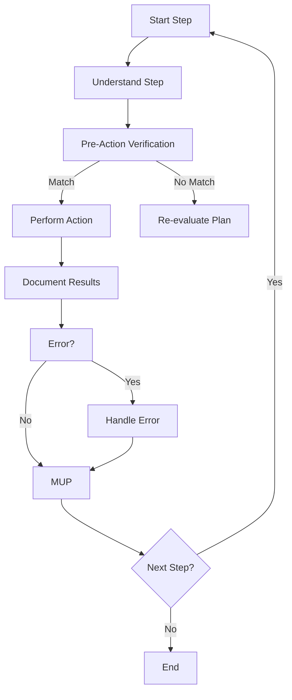

# **Cline Recursive Chain-of-Thought System (CRCT) - Execution Plugin**

**This Plugin provides detailed instructions and procedures for the Execution phase of the CRCT system. It should be used in conjunction with the Core System Prompt.**

---

## I. Entering and Exiting Execution Phase

**Entering Execution Phase:**
1. **`.clinerules` Check**: Always read `.clinerules` first. If `[LAST_ACTION_STATE]` shows `current_phase: "Execution"`, proceed with these instructions.
2. **Transition from Strategy**: Enter after Strategy; `.clinerules` `next_phase` will be "Execution".
3. **User Trigger**: Start a new session post-Strategy or to resume execution.

**Exiting Execution Phase:**
1. **Completion Criteria:**
   - All steps in the instruction file(s) are executed.
   - Expected outputs are generated.
   - Results and observations are documented.
   - MUP is followed for all actions.
2. **`.clinerules` Update (MUP):**
   - To return to Set-up/Maintenance for verification:
     ```
     last_action: "Completed Execution Phase - Tasks Executed"
     current_phase: "Execution"
     next_action: "Phase Complete - User Action Required"
     next_phase: "Set-up/Maintenance"
     ```
   - For project completion:
     ```
     last_action: "Completed Execution Phase - Project Objectives Achieved"
     current_phase: "Execution"
     next_action: "Project Completion - User Review"
     next_phase: "Project Complete"
     ```
   *Note: "Project Complete" pauses the system; define further actions if needed.*
3. **User Action**: After updating `.clinerules`, pause for user to trigger the next phase. See Core System Prompt, Section III for a phase transition checklist.

---

## II. Loading Context for Execution

**Action**: Load context for task execution.
**Procedure:**
- Load the applicable `implementation_plan_{filename}.md`
- Load current Task (`{task_name}.md`)
- Check dependencies for relevant files/modules using `show-dependencies --key <key>`. This command searches all trackers automatically.
  ```bash
  # Example: Check dependencies for file represented by key 1A1
  python -m cline_utils.dependency_system.dependency_processor show-dependencies --key 1A1
  ```
- Load Tasks/SubTasks listed as dependencies in the Implementation Plan or identified via `show-dependencies`.
- Load dependency files identified via `show-dependencies` using `read_file`.

---

## III. Executing Tasks from Instruction Files

**Action**: Execute the step-by-step plan in the instruction file.
**Procedure:**
1. **Iterate Through Steps:**
   - **Understand the Step**: Clarify the action required.
   - **Pre-Action Verification (MANDATORY)**: Before file modifications (`replace_in_file`, `write_to_file`, etc.):
     - Re-read target file with `read_file`.
     - Generate "Pre-Action Verification" Chain-of-Thought:
       1. **Intended Change**: State the change (e.g., "Replace line X with line Y in file Z").
       2. **Expected Current State**: Describe expected state (e.g., "Line X is A").
       3. **Actual Current State**: Note actual state from `read_file` (e.g., "Line X is B").
       4. **Validation**: Compare; proceed if matching, otherwise re-evaluate.
     - Example:
       ```
       1. Intended Change: Replace line 10 with "process_data()" in `utils/data_utils.py`.
       2. Expected Current State: Line 10 is "clean_data()".
       3. Actual Current State: Line 10 is "clean_data()".
       4. Validation: Match confirmed; proceed.
       ```
   - **Perform Action**: Execute the step (e.g., `write_to_file`).
   - **Document Results (Mini-CoT)**: Record outcomes and insights.
   - **MUP**: Follow Core MUP and Section IV additions after each step.
2. **Error Handling:**
   - Document error message and context.
   - Diagnose cause using recent actions and state.
   - Resolve by revising steps, dependencies, or seeking clarification.
   - Record resolution or next steps.
   - Apply MUP post-resolution.
3. **Code Generation and Modification Guidelines:**
When generating or modifying code, adhere to the following standards to ensure quality, maintainability, and security:
  1. **Modularity**:
    - Write small, single-purpose functions/methods and classes/modules with high cohesion and low coupling.
    - Design reusable components to enhance maintainability.
  2. **Clarity and Readability**:
    - Use meaningful names for variables, functions, and classes.
    - Follow language-specific formatting conventions (e.g., PEP 8 for Python).
    - Add comments only for complex logic or intent, avoiding redundant explanations of *what* the code does.
    - Include necessary imports and setup in code examples unless a snippet is requested.
  3. **Error Handling**:
    - Anticipate errors (e.g., invalid inputs, file not found) and implement robust handling (e.g., try-except, return value checks).
    - Validate inputs and assumptions to prevent errors early.
  4. **Efficiency**:
    - Prioritize clarity and correctness but be mindful of algorithmic complexity for performance-critical tasks.
  5. **Documentation**:
    - Add docstrings or comments for public APIs or complex functions, detailing purpose, parameters, and return values.
    - Keep documentation concise and synchronized with code changes.
  6. **Testing**:
    - Write testable code and, where applicable, suggest or include unit tests for new functionality or fixes.
  7. **Dependency Management**:
    - Minimize external dependencies and justify their inclusion when necessary.
  8. **Security**:
    - Follow secure coding practices to mitigate vulnerabilities (e.g., avoid injection risks, secure credential handling).
4. **Execution Flowchart**



---

## IV. Execution Plugin - MUP Additions

After Core MUP steps:
1. **Update Instruction File**: Save modifications (e.g., notes), avoiding major "Steps" changes unless critical. Update completion status.
2. **Update Mini-Trackers**: If execution created a new dependency within a module, reflect it in the corresponding `{module_name}_module.md` mini-tracker using `add-dependency`:
   - Example (adding dependency from function/file 2Ca1 to 2Ca3 within module 'C'):
     ```bash
     python -m cline_utils.dependency_system.dependency_processor add-dependency --tracker path/to/module_C/module_C_module.md --source-key 2Ca1 --target-key 2Ca3 --dep-type ">"
     ```
3. **Update Domain Module Documents:** If the task execution introduces new dependencies or modifies existing ones, update the relevant Domain document.     
4. **Update `.clinerules` [LAST_ACTION_STATE]:**
   - After a step:
     ```
     last_action: "Completed Step 1 in {task_name}.md"
     current_phase: "Execution"
     next_action: "Execute Step 2"
     next_phase: "Execution"
     ```
   - After all steps:
     ```
     last_action: "Completed all steps in {task_name}.md"
     current_phase: "Execution"
     next_action: "Phase Complete - User Action Required"
     next_phase: "Set-up/Maintenance"
     ```

---

## V. Quick Reference
- **Actions:**
  - Execute steps: Follow instruction file steps.
  - Verify actions: Perform pre-action checks.
- **Files:**
  - Instruction files: Contain execution steps.
  - `activeContext.md`: Tracks execution state.
  - Mini-trackers: Reflect new dependencies.
- **MUP Additions:** Update instruction files, trackers, Module documents, and `.clinerules`.

---

## VI. Error Handling and Performance Optimization

### VI.1 Dependency Command Error Handling
When encountering errors with `dependency_processor.py` commands:
1.  **Check Logs**: Always review `debug.txt` and `suggestions.log` first for detailed error messages and context.
2.  **`analyze-project` Errors**:
    *   **File Not Found**: Ensure the project structure is correct and paths in `.clinerules.config.json` (especially `code_root_dirs`, `doc_dir`) are valid relative to the project root where the command is run.
    *   **Embedding Errors**: May indicate issues with installing `sentence-transformers` or accessing model files. Check environment setup. Consider running with `--force-embeddings` if caches might be corrupt.
    *   **Permission Errors**: Check file/directory permissions.
3.  **`show-dependencies` Errors**:
    *   **Key Not Found**: The specified key might not exist in any tracker. Verify the key is correct. Run `analyze-project` if the file/key should exist but isn't in the trackers.
4.  **`add-dependency` Errors**:
    *   **Tracker Not Found**: Verify the `--tracker` path is correct.
    *   **Key Not Found**: Ensure `--source-key` and `--target-key` exist in the specified tracker. Run `analyze-project` if needed.
    *   **Grid Errors**: If the tracker file is corrupted, running `analyze-project` might fix it by regenerating keys and structure. If not, manual inspection or restoring from backup (`cline_docs/backups/`) might be needed.
5.  **`remove-file` Errors**:
    *   **Tracker/File Not Found**: Verify paths are correct.
    *   **Grid Errors**: Similar to `add-dependency`, try `analyze-project`.
6.  **General Tips**:
    *   Use `clear-caches` if you suspect outdated cache data is causing issues.
    *   Ensure you are running commands from the project root directory.
    *   Verify Python environment has necessary packages (`requirements.txt`).

*(Paths like `cline_docs`, `src`, etc., are based on configuration in `.clinerules.config.json`)*
