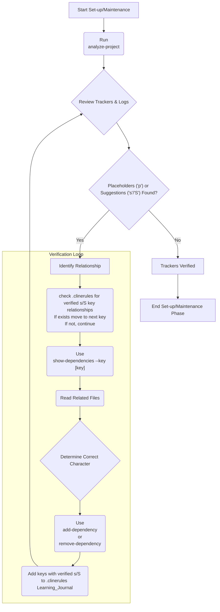

# **Cline Recursive Chain-of-Thought System (CRCT) - Set-up/Maintenance Plugin**

**This Plugin provides detailed instructions and procedures for the Set-up/Maintenance phase of the CRCT system. It should be used in conjunction with the Core System Prompt.**

---

## I. Entering and Exiting Set-up/Maintenance Phase

**Entering Set-up/Maintenance Phase:**
1. **Initial State**: Start here for new projects or if `.clinerules` shows `current_phase: "Set-up/Maintenance"`.
2. **`.clinerules` Check**: Always read `.clinerules` first. If `[LAST_ACTION_STATE]` indicates "Set-up/Maintenance", proceed with these instructions.
3. **New Project**: If `.clinerules` is missing/empty, assume this phase and initialize core files.

**Exiting Set-up/Maintenance Phase:**
1. **Completion Criteria:**
   - All core files exist and are initialized.
   - `doc_tracker.md` is populated (no 'p' placeholders).
   - `module_relationship_tracker.md` is populated (no 'p' placeholders).
   - `system_manifest.md` is created.
   - Templates in `cline_docs/templates/` are used to create the necessary files and instructions.   
   - Mini-trackers are created/populated as needed.
2. **`.clinerules` Update (MUP):**
   ```
   last_action: "Completed Set-up/Maintenance Phase"
   current_phase: "Set-up/Maintenance"
   next_action: "Phase Complete - User Action Required"
   next_phase: "Strategy"
   ```
3. **User Action**: After updating `.clinerules`, pause for user to trigger the next session (e.g., reset context in VS Code). See Core System Prompt, Section III for a phase transition checklist.

---

## II. Initializing Core Required Files

**Action**: Ensure all core files exist, creating them if missing as specified.

**Procedure:**
1.  **Check for Existence**: Check if each core file (`.clinerules`, `system_manifest.md`, `activeContext.md`, `module_relationship_tracker.md`, `changelog.md`, `doc_tracker.md`) exists.
2.  **Identify Code and Documentation Directories**: If `[CODE_ROOT_DIRECTORIES]` or `[DOC_DIRECTORIES]` in `.clinerules` are empty or missing, follow the procedures in Core Prompt Sections X and XI to identify and populate these sections.
3.  **Create Missing Files:**
    *   For `.clinerules`, `activeContext.md`, `changelog.md`: Use `write_to_file` to create manually with minimal content.
    *   For `system_manifest.md`: Use `write_to_file` to create it, then populate it using the template from `cline_docs/templates/system_manifest_template.md`.
    *   For tracker files (`module_relationship_tracker.md`, `doc_tracker.md`): Run `analyze-project`. This command will create or update the trackers based on project analysis.
     ```
     python -m cline_utils.dependency_system.dependency_processor analyze-project
     ```
    *(Mini-trackers in module directories are also created/updated by `analyze-project`)*

   - **Important**: Do not manually create tracker files. **Always** use `analyze-project` for initial setup and subsequent updates to ensure proper structure, key generation, and data consistency.
   - Example Initial `.clinerules`:
     ```
     [LAST_ACTION_STATE]
     last_action: "System Initialized"
     current_phase: "Set-up/Maintenance"
     next_action: "Initialize Core Files"
     next_phase: "Set-up/Maintenance"
     ```
3. **MUP**: Follow Core Prompt MUP after creating files.

---

## III. Analyzing and Verifying Tracker Dependencies

**Objective**: Ensure trackers accurately reflect project dependencies, removing 'p' placeholders. **All tracker modifications MUST use `dependency_processor.py` commands.**

**Procedure:**

1.  **Run Project Analysis (Initial & Updates)**:
    *   Use `analyze-project` to automatically generate keys, analyze files, suggest dependencies (based on imports and semantic similarity), and update all trackers (`module_relationship_tracker.md`, `doc_tracker.md`, and mini-trackers). This should populate the grid, potentially with 'p', 's', 'S', '<', '>', 'x', or 'd' characters.
    ```bash
    python -m cline_utils.dependency_system.dependency_processor analyze-project
    ```
    *   *(Optional: Add `--force-analysis` or `--force-embeddings` if needed)*.
    *   **Review logs (`debug.txt`, `suggestions.log`)** for analysis details and suggested changes.

2.  **Review and Verify Placeholders ('p') and Suggestions ('s', 'S')**:
    *   **IMPORTANT**: Use `show-keys` or `show-dependencies` commands to inspect tracker content. **Avoid** using `read_file` on tracker files directly to save context and ensure correct parsing.
    *   For each relationship marked with 'p', 's', or 'S':
        *   Use `show-dependencies --key <key>` to understand the full context (dependencies) of related files.
        *   **IMPORTANT**:    
            *   **The key used with `show-dependencies` is the *row*, the dependencies returned are the *column*.**
            *   When reviewing the output the keys listed are the *column* keys that have a dependency with the *row* key you provided to the `show-dependencies` command.
        *   *(If you only need to see the key definitions for a specific tracker, use `python -m cline_utils.dependency_system.dependency_processor show-keys --tracker <path>` for efficiency.)*
        *   If dependency context isn't clear from `show-dependencies`, examine the source code or documentation of the *related files* themselves using `read_file` (e.g., `read_file <path_from_show_dependencies_output>`).
        *   **Note:** If `show-dependencies` lists keys that are not present in the tracker you are currently inspecting (e.g., code file keys in `doc_tracker.md`), these dependencies belong in a different tracker (like `module_relationship_tracker.md` or mini-trackers) and should be addressed there. Do not attempt to set these dependencies in the current tracker.
        *   Determine the correct dependency relationship (or confirm 'n' - no dependency). Record the verification of s/S for that key in .clinerules [LEARNING_JOURNAL]. Refer to **IV.1 Dependency Characters**.
        *   When determing the dependency relation between files, determine if one or both **functionally relies** on the other, or if one document provides information that would be **helpful when writing code related to the other document's content**. If neither is the case, assign 'n' (no dependency).

3.  **Correct/Confirm Dependencies**:
    *   If a 'p', 's', or 'S' needs to be changed to a specific relationship ('<', '>', 'x', 'd', 'n'):
        *   Use `add-dependency` to set the correct character. This command can now accept multiple target keys.
        ```bash
        # Example: Set dependency between 2Aa and multiple targets (3Aa, 3Ab) in main tracker
        `python -m cline_utils.dependency_system.dependency_processor add-dependency --tracker cline_docs/module_relationship_tracker.md --source-key 2Aa --target-key 3Aa 3Ab --dep-type ">"`
        
        # Example: Set NO dependency ('n') between 2Aa and a single target 3Aa
        `python -m cline_utils.dependency_system.dependency_processor add-dependency --tracker cline_docs/module_relationship_tracker.md --source-key 2Aa --target-key 3Aa --dep-type "n"`
        ```
        *(Note: --target-key accepts multiple keys. The specified `--dep-type` is applied to *all* targets.)*
        *(Recommendation: Specify no more than five target keys at once for clarity.)*
    *   If a suggested relationship ('<', '>', 'x', 'd') seems incorrect, use `add-dependency` to set the correct character (e.g., 'n' if there's no dependency, or '<' if the direction is wrong).
4.  **Iterate and Complete**: Repeat steps 2 and 3 until no 'p' placeholders remain in the primary trackers (`module_relationship_tracker.md`, `doc_tracker.md`). Prioritize clearing these before moving to Strategy phase. Mini-tracker verification can continue iteratively.

5.  **MUP**: Apply Core MUP and Section VII additions after each verification/correction session and upon completion of primary tracker verification.

---

## IV. Dependency Tracker Management (Details)
*(Dependency character definitions are in the Core System Prompt, Section V)*

### IV.1 Hierarchical Key System
- **Purpose**: Encodes hierarchy in trackers.
- **Structure**: Tier (number), Directory (uppercase), Subdirectory (lowercase), File (number).
- **Examples**: `1A` (top-level dir 'A'), `1A1` (first file in 'A'), `2Ba3` (third file in subdir 'a' of 'B').

### IV.3 Grid Format and X-Axis Header
- **X-Axis Header**: "X " followed by column keys.
- **Dependency Rows**: Row key, " = ", compressed string (RLE, excluding 'o').

### IV.4 Dependency Processor Commands

*(Refer to the Core System Prompt, Section VIII, for a more comprehensive list and detailed description of common `dependency_processor.py` commands.)*

**Key commands for configuration and setup in this phase include:**

-   **`update-config <key_path> <value>`**: Updates a configuration setting in `.clinerules.config.json`.
    -   *Example*: `python -m cline_utils.dependency_system.dependency_processor update-config thresholds.code_similarity 0.8`
    -   *Example*: `python -m cline_utils.dependency_system.dependency_processor update-config models.doc_model_name all-MiniLM-L6-v2`
    -   This command can be used to adjust various settings, including embedding model names (`models.doc_model_name`, `models.code_model_name`), similarity thresholds (`thresholds.doc_similarity`, `thresholds.code_similarity`), and compute device (`compute.embedding_device`).

-   **`reset-config`**: Resets all configuration settings in `.clinerules.config.json` to their default values.
    -   *Example*: `python -m cline_utils.dependency_system.dependency_processor reset-config`

*Note: For a full list of commands, refer to the Core System Prompt. This plugin focuses on the commands most relevant for setup and maintenance.*

*Key commands used in this phase include `analyze-project`, `show-dependencies`, `add-dependency`, `update-config`, `reset-config`, and `remove-dependency` as detailed in the procedures above.*

### IV.5 Set-up/Maintenance Dependency Workflow


---

## V. Populating Mini-Trackers

**Objective**: Create and populate mini-trackers in `{module_dir}/{module_dir}_main_instructions.txt`.

**Procedure:**
1. **Identify Modules**: Use `module_relationship_tracker.md` directories.
2. **Instruction File Check:**
   - If `{module_dir}/{module_dir}_main_instructions.txt` is missing:
     - Create with basic structure (see Core Prompt, Section VII).
     - Initialize mini-tracker:       
   - If it exists, proceed to Step 3.
3. **Suggest and Validate**: See **Section IV.5** for example commands. Adapt `--tracker` and keys accordingly.
5. **Iterate and Complete**: Repeat until populated.
6. **MUP**: Apply Core MUP and Section VI additions.

---

## VI. Set-up/Maintenance Plugin - MUP Additions

After Core MUP steps:
1. **Update `system_manifest.md`**: Ensure it's initialized using the template.
2. **Update `module_relationship_tracker.md`**: Save changes from commands.
3. **Update `doc_tracker.md`**: Save changes.
4. **Update Mini-Trackers**: Save changes.
5. **Update `.clinerules` [LAST_ACTION_STATE]:**

    - Example after `doc_tracker.md`:

    ```
    [LAST_ACTION_STATE]
    last_action: "Populated doc_tracker.md"
    current_phase: "Set-up/Maintenance"
    next_action: "Populate module_relationship_tracker.md"
    next_phase: "Set-up/Maintenance"
    ```
