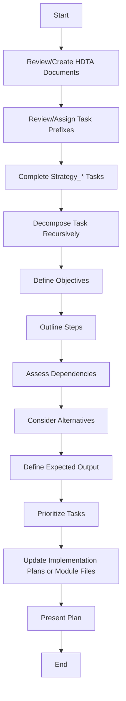

# **Cline Recursive Chain-of-Thought System (CRCT) - Strategy Plugin v7.6**

**This Plugin provides detailed instructions and procedures for the Strategy phase of the CRCT system. It guides the critical, exhaustive process of translating the high-level system design into a fully sequenced and actionable implementation plan based on verified project dependencies. All planning, from top-level modules to granular tasks, must be completed before transitioning to Execution. Use this in conjunction with the Core System Prompt.**

---

**Entering and Exiting Strategy Phase**

**Entering Strategy Phase:**
1. **`.clinerules` Check (Mandatory First Step)**: Read `.clinerules` file content.
2. **Determine Current State**:
   * If `[LAST_ACTION_STATE]` section indicates `current_phase: "Strategy"`, proceed with the instructions below, starting from the action indicated by `next_action`.
   * If `[LAST_ACTION_STATE]` section indicates `next_phase: "Strategy"`, this signifies a transition from a previous phase (likely Set-up/Maintenance). Proceed with the instructions below, starting from **Section II, Step 1**.
3. **User Trigger**: If starting a new session and `.clinerules` indicates the system *was* in Strategy or *should transition* to Strategy, proceed with these instructions.

**Exiting Strategy Phase:**
1. **Completion Criteria (Mandatory Check)**: Verify ALL the following are met:
   * A comprehensive implementation sequence based on dependency analysis has been defined for all modules and files (documented in Implementation Plans or respective `*_module.md` files).
   * All high-priority work planned for this strategy cycle has been decomposed into atomic Task Instructions, with clear phase prefixes (`Strategy_*`, `Execution_*`).
   * All necessary HDTA documents (System Manifest, Domain Modules, Implementation Plans, Task Instructions) have been created or updated, with no placeholders or incomplete sections.
   * Tasks have been prioritized for the Execution phase (documented in Implementation Plans or respective `*_module.md` files).
   * All HDTA documents are correctly linked (Tasks from Plans, Plans from Modules, Modules from Manifest).
   * All `Strategy_*` tasks have been completed.
2. **`.clinerules` Update (Mandatory MUP Step)**: If completion criteria are met, update `.clinerules` **exactly** as follows:
   ```
   [LAST_ACTION_STATE]
   last_action: "Defined Comprehensive Implementation Sequence and Prioritized Tasks"
   current_phase: "Strategy"
   next_action: "Phase Complete - User Action Required"
   next_phase: "Execution"
   ```
3. **Pause for User Action**: After successfully updating `.clinerules`, state that the Strategy phase is complete and you are awaiting user action (e.g., a new session start) to begin the Execution phase. Do not proceed further in this session.

## I. Phase Objective & Guiding Principles

**Objective**: To create a comprehensive, dependency-aware **implementation roadmap** that spans all modules and files for the current development cycle. This exhaustive process involves reviewing and creating all necessary HDTA documentation, strategically decomposing goals into actionable tasks with appropriate phase prefixes (`Strategy_*`, `Execution_*`), determining the correct build order based on verified dependencies, and prioritizing work for the Execution phase. All planning must be completed before moving forward.

**Guiding Principles**:
1. **Exhaustive HDTA Review and Creation**: All HDTA documentation (System Manifest, Domain Modules, Implementation Plans, Task Instructions) must be reviewed for accuracy and completeness as the first step. If any document is missing, create it using the appropriate template. If it exists, ensure it has no placeholders or incomplete sections.
2. **Dependency-Driven Sequencing**: Verified relationships ('<', '>', 'x', 'd') in trackers (`doc_tracker.md`, mini-trackers, `module_relationship_tracker.md`) are the **primary guide** for determining task order. Use `show-dependencies` extensively to understand constraints.
3. **Plan Top-Down, Build Bottom-Up**: Define the strategy starting from high-level goals (`system_manifest.md`, `activeContext.md`) and progressively decompose them through Domain Modules, Implementation Plans, and finally into specific Tasks. Execution order is determined by starting with foundational tasks (those with no '<' dependencies) and building upwards.
4. **Strategic HDTA Creation**: HDTA documents are the **structured output of the strategic planning process**, capturing objectives, steps, context, and dependencies. Create or update them *as needed* to define the plan.
5. **Clear Phase Labeling**: Tasks must be prefixed with `Strategy_*` (for planning tasks to be completed in this phase) or `Execution_*` (for tasks to be completed in the Execution phase). Unprefixed tasks must be analyzed and assigned the correct prefix.
6. **Minimal Context, Maximum Guidance**: Create clear, concise instructions and plans that provide the Execution phase with necessary guidance and context links without unnecessary detail.
7. **Comprehensive Planning**: The Strategy phase is an in-depth, extensive process. All modules, features, and files must be fully planned, with no gaps, before transitioning to Execution.

---

## II. Strategic Planning Workflow: Defining the Implementation Roadmap

**Directive**: Develop a comprehensive implementation roadmap by reviewing and creating all HDTA documentation, completing all `Strategy_*` tasks, systematically decomposing goals, rigorously analyzing dependencies and their underlying meaning, sequencing granular tasks with appropriate phase prefixes, and prioritizing work for focused execution. This is an exhaustive process that must cover all modules and files.

**Procedure**:

1. **Review and Create HDTA Documentation Mandatory **Action**: Review all existing HDTA documents (`system_manifest.md`, `*_module.md`, `implementation_plan_*.md`, `*.md` Task Instructions) for accuracy and completeness.
      * **For Each Document**:
         * **A. Existence Check**: Verify if the document exists for each required HDTA tier (System Manifest, Domain Modules, Implementation Plans, Task Instructions).
            * If missing: State "File `{file_path}` does not exist. Creating using template." Use the appropriate template from `cline_docs/templates/` (e.g., `system_manifest_template.md`, `module_template.md`, `implementation_plan_template.md`, `task_template.md`) and create the document with all required sections filled.
            * If exists: State "File `{file_path}` exists. Reviewing for accuracy and completeness."
         * **B. Accuracy and Completeness Check**: Ensure the document has no placeholders, incomplete sections, or outdated information.
            * If incomplete or outdated: State "File `{file_path}` contains placeholders or is incomplete. Updating." Update using the template structure, preserving valid content and filling in missing details.
            * If complete and accurate: State "File `{file_path}` is complete and accurate. No update needed."
         * **C. Create/Update**: If creation or update is needed, use `write_to_file` to save the document, ensuring all required sections are filled based on the template and dependency analysis.
   * **Action**: Ensure `system_manifest.md` includes all Domain Modules, and each Domain Module links to its Implementation Plans, which in turn link to Task Instructions.
   * **Action**: Verify that all HDTA documents are free of placeholders and fully specify objectives, steps, dependencies, and context links.

2. **Review and Assign Task Prefixes**:
   * **Action**: Scan all Task Instructions for unprefixed tasks (e.g., `task_name.md` instead of `Strategy_task_name.md` or `Execution_task_name.md`).
      * For each unprefixed task:
         * Analyze the task’s content to determine its purpose.
         * Assign the appropriate prefix:
            * `Strategy_*`: For tasks involving planning, decomposition, or HDTA document creation/updates (to be completed in this phase).
            * `Execution_*`: For tasks involving code implementation, file modifications, or other execution steps (to be completed in the Execution phase).
         * Rename the file to include the prefix (e.g., `task_name.md` → `Strategy_task_name.md` or `Execution_task_name.md`) using `write_to_file`.
         * State: "Task `{task_name}` lacks prefix. Analyzed and assigned prefix `{Strategy_|Execution_}`. Renamed to `{new_file_name}`."
   * **Action**: List all tasks with their assigned prefixes in the respective `implementation_plan_*.md` or `*_module.md` file for clarity.

3. **Complete Strategy_* Tasks**:
   * **Action**: Identify and execute all tasks prefixed with `Strategy_*`.
      * **Prioritization**: Complete these tasks before proceeding to further planning steps, as they may involve critical planning or decomposition work.
      * **Execution**: For each `Strategy_*` task:
         * Read the task’s instructions and follow its steps.
         * Update or create HDTA documents as specified.
         * Mark the task as complete in its file and in the respective `implementation_plan_*.md` or `*_module.md` file.
         * State: "Completed `Strategy_{task_name}`. Updated `{affected_files}`."
      * **Verification**: Ensure no `Strategy_*` tasks remain incomplete before proceeding.
      * State: "All `Strategy_*` tasks completed. Proceeding with roadmap development."

4. **Review Current State & Goals**:
   * **Action**: Read and analyze `activeContext.md` for current priorities, decisions, and cycle goals.
   * **Action**: Read and analyze `system_manifest.md` for system architecture and component overview.
   * *These should have already been read before loading this plugin. Only read if you have *not* already read them.*

5. **Identify Target Area(s)**:
   * **Action**: Based on Step 4, explicitly state the primary module(s) or feature(s) selected as the focus for this planning cycle. Ensure all modules are covered in the roadmap.

6. **Analyze Dependencies & Understand Interactions**:
   * **CRITICAL STEP**: For all target areas, use the dependency system to deeply understand the nature of interactions *before* detailed planning. This is mandatory for correct sequencing across all modules.
   * **Action**: Execute `show-dependencies --key <relevant_key>` for key files or modules involved (e.g., main module key like `1Ba`, or specific file key like `1Ba2`).
   * **Interpret Dependencies**:
      * `Depends On ('<')`: Files/modules listed are **prerequisites**. Work cannot start until these are complete.
         * When show-dependencies returns '<' relationship:
            1. Read source/target files via `read_file`.
            2. Perform line-level analysis (function/method calls, class inheritance, documentation references).
            3. Confirm relationship type matches actual usage.
      * `Depended On By ('>')`: Files/modules rely on the key. Changes may impact downstream components.
      * `Documentation ('d')`: Indicates essential documentation links. Ensure linked docs are created/updated.
      * `Mutual ('x')`: Suggests tightly coupled components needing coordinated development or careful sequencing.
   * Review `doc_tracker.md`, mini-trackers (`*_module.md`), and `module_relationship_tracker.md` using `show-keys` and `show-dependencies` to confirm relationships.
   * **MANDATORY: Deepen Understanding**: Use `read_file` to examine the *content* of files associated with critical dependencies ('<', '>', 'x', 'd'). Ask:
      * *Why* does A depend on B? (Function call, data structure, conceptual prerequisite?)
      * What *specific* parts of B are relevant to A?
      * What is the *implication* for implementation order and refactoring?
   * This understanding is essential for accurate decomposition and sequencing.

7. **Decompose & Define HDTA Structure (Top-Down Planning, Atomic Tasks)**:
   * **Directive**: Based on goals and the *understanding* from Step 3, determine the necessary HDTA documents. Decompose work into the smallest logical, actionable units suitable for execution with limited context.
   * **Recursive Decomposition for Execution:** Break down work identified in Implementation Plans into the smallest logical, actionable units. The goal is to create **atomic Task Instructions (`*.md`)** that can be executed independently by an LLM with a **limited context window**.
      * Each Task Instruction should represent a single, focused change (e.g., implement one function, modify a specific class method, update a section of documentation).
      * Crucially, each Task Instruction file must explicitly list *only* the **minimal necessary context** (links to specific function definitions, relevant documentation keys/sections, data structures) required to complete *that specific task*, derived from your analysis in Step 3. Avoid linking unnecessary files.
   * **HDTA Document Creation/Update**:
      * **Action**: For each required HDTA document (Domain Module, Implementation Plan, Task Instruction):
        * **A. Existence Check (Mandatory)**: Check if the target file path already exists.
        * **B. Decision & Rationale**:
            * If exists and current content is sufficient/accurate for the plan: State "File `{file_path}` exists and is sufficient. No update needed." Proceed to next document/step.
            * If exists but outdated/incomplete: State "File `{file_path}` exists but needs updates. Proceeding to update."
            * If not exists: State "File `{file_path}` does not exist. Proceeding to create."
        * **C. Create/Update**: If creation or update is needed, use `write_to_file`. Load the appropriate template from `cline_docs/templates/`. Fill in **all required sections** of the template with precise details based on your analysis.
     * **Specific Document Content Directives**:
        * **Domain Module (`*_module.md`)**: Required if planning involves a new major functional area or significant changes to an existing one. Use the template (`module_template.md`) to define its purpose, interfaces, and scope *within the context of the overall system and its dependencies*. If creating a new module, remember to manually add it to `system_manifest.md`.
        Include relevant **Implementation Details** (key files, algorithms, models planned *for this module*). List associated Implementation Plans.
        * **Implementation Plan (`implementation_plan_*.md`)**: Required for planning features or groups of related changes affecting multiple files. Use the template (`implementation_plan_template.md`) to outline the high-level approach, affected components (linking to their keys/docs), and major steps. Link this plan from the relevant Domain Module(s).
        Detail **Design Decisions**, **Algorithms**, and **Data Flow** relevant *to this specific plan*. List the sequence of atomic **Task Instructions** required to fulfill this plan.
        * **Task Instruction (`*.md`)**: Required for specific, actionable implementation steps within an Implementation Plan. Use the template (`task_template.md`) to detail the objective, **precise step-by-step instructions**, *minimal necessary context links*, **explicit `Dependencies` (Requires/Blocks task links)**, and expected output for *one atomic task*. Reference its parent Implementation Plan.
   * **Linking (Mandatory)**:
      * Add new Domain Modules to `system_manifest.md` registry.
      * Link Implementation Plans from their parent Domain Module.
      * Link Task Instructions from their parent Implementation Plan.
      * Fill the `Dependencies` (Requires/Blocks) section in Task Instructions.
   * **Add Missing Dependency Links**: While defining HDTA documents, if you identify crucial dependency links (especially code-to-doc) that were missed during Set-up/Maintenance and are necessary for context, use `add-dependency` to add them to the appropriate tracker (usually the mini-tracker for the code file). State your reasoning clearly.

8. **Determine Build Sequence (Bottom-Up Execution Order)**:
   * **Directive**: Sequence **atomic Task Instructions** based on dependencies analyzed in Step 6.
      * Identify foundational tasks/components: Those with no outgoing '<' dependencies within the current scope of work. These should generally be implemented first.
      * Sequence subsequent tasks: Order subsequent tasks ensuring prerequisites are met according to your understanding of the interactions (not just the characters). For 'x' dependencies, plan for potentially iterative or closely coordinated implementation steps across the linked tasks.
   * Document the final sequence and the dependency-based rationale within the relevant Implementation Plan(s) or the module's `*_module.md` file.

9. **Prioritize Tasks within Sequence**:
   * Within the determined build sequence, prioritize tasks based on:
      * Urgency/importance defined in `activeContext.md`.
      * Potential to unblock other tasks.
      * Logical grouping of related work.
   * Record the final prioritization order and explicit reasoning within the relevant Implementation Plan(s) or the module's `*_module.md` file.

10. **Present Plan**: Summarize the planned work, the determined sequence, the created/updated HDTA documents, and the task prioritization for user review and confirmation.

**Task Planning Flowchart**


---

## III. Strategy Plugin - Mandatory Update Protocol (MUP) Additions

After Core MUP steps:
1. **Save HDTA Documents**: Ensure all new or modified Domain Modules, Implementation Plans, and Task Instructions are saved.
2. **Update `system_manifest.md`**: Add links to any *new* Domain Modules created.
3. **Update Linking HDTA Docs**: Ensure Implementation Plans link to their Tasks, and Domain Modules link to their Implementation Plans.
4. **Update `activeContext.md` with Strategy Outcomes**:
   * Summarize the comprehensive strategy and reference the detailed implementation sequence in the respective `implementation_plan_*.md` or `*_module.md` files.
   * List key HDTA documents created/updated.
   * Reference task priorities, prefixes, and dependency-based reasoning in the respective `implementation_plan_*.md` or `*_module.md` files.
5. **Update `.clinerules` [LAST_ACTION_STATE]:**
   ```
   [LAST_ACTION_STATE]
   last_action: "Defined Comprehensive Implementation Sequence and Prioritized Tasks"
   current_phase: "Strategy"
   next_action: "Phase Complete - User Action Required"
   next_phase: "Execution"
   ```

---

## IV. Quick Reference

**Goal**: Create a comprehensive, dependency-aware implementation roadmap covering all modules and files.
**Key Actions**:
 * Review/create all HDTA documents (System Manifest, Domain Modules, Implementation Plans, Task Instructions).
 * Assign `Strategy_*` or `Execution_*` prefixes to tasks.
 * Complete all `Strategy_*` tasks before further planning.
 * Analyze dependencies (`show-dependencies`).
 * Decompose goals (top-down).
 * Define HDTA documents strategically.
 * Determine build sequence (bottom-up).
 * Prioritize tasks within the sequence.
 * Manually link HDTA documents and add missing dependencies via `add-dependency`.
**Key Inputs**: `activeContext.md`, `system_manifest.md`, Verified Trackers.
**Key Outputs**: Updated `activeContext.md`, new/updated HDTA documents, updated `implementation_plan_*.md` or `*_module.md` files, updated `.clinerules`.
**MUP Additions**: Save HDTA, update `system_manifest.md` (if needed), update `activeContext.md`, update `implementation_plan_*.md` or `*_module.md` files, update `.clinerules`.

---

**Note**: The Strategy phase is an exhaustive, in-depth process. All planning for all modules and files must be completed, with no gaps, before transitioning to Execution. This ensures a robust, dependency-aware roadmap that supports efficient and accurate execution.
