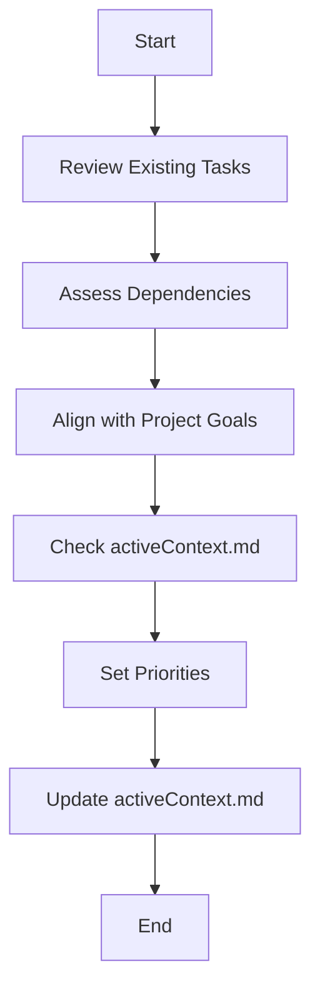

# **Cline Recursive Chain-of-Thought System (CRCT) - Strategy Plugin**

**This Plugin provides detailed instructions and procedures for the Strategy phase of the CRCT system. It should be used in conjunction with the Core System Prompt.**

---

## I. Entering and Exiting Strategy Phase

**Entering Strategy Phase:**
1. **`.clinerules` Check**: Always read `.clinerules` first. If `[LAST_ACTION_STATE]` shows `current_phase: "Strategy"`, proceed with these instructions.
2. **Transition from Set-up/Maintenance**: Enter after Set-up/Maintenance; `.clinerules` `next_phase` will be "Strategy".
3. **User Trigger**: Start a new session after Set-up/Maintenance or to resume strategy.

**Exiting Strategy Phase:**
1. **Completion Criteria:**
   - Domain Module and Task Instruction documents for prioritized tasks are created, with objectives, context, and steps defined.
   - Tasks are prioritized and ready for execution.
   - Strategy objectives for the cycle are met.
2. **`.clinerules` Update (MUP):**
   ```
   last_action: "Completed Strategy Phase - Tasks Planned"
   current_phase: "Strategy"
   next_action: "Phase Complete - User Action Required"
   next_phase: "Execution"
   ```
3. **User Action**: After updating `.clinerules`, pause for user to trigger Execution phase via a new session. See Core System Prompt, Section III for a phase transition checklist.

---

## II. Loading Context for Strategy

**Action**: Load context to guide strategy.
**Procedure:**
- Load core files: `.clinerules`, `system_manifest.md`, `activeContext.md`.
- Review `system_manifest.md` for system overview and component relationships.
- Review `activeContext.md` for current state, decisions, and priorities.
- Check `module_relationship_tracker.md` and `doc_tracker.md` for module and documentation dependencies.

---

## III. Creating New HDTA Documents

**Action**: Create *Domain Module* (`{module_name}_module.md`), *Implementation Plans* (`implementation_plan_{filename}.md`) and *Task Instruction* (`{task_name}.md`) documents as needed, ensuring no unnecessary overwrites.

**Procedure:**

1.  **Determine Document Tier:** Based on the task, decide which documents to create.
    *   **Domain Module:**  For defining new major functional areas or significantly modifying existing ones.
    *   **Implementation Plan** High level file plans.
    *   **Task Instruction:**  For specific, actionable tasks within an Implementation plan.

2.  **Choose Document Name and Location:**
    *   **Domain Module:** `{module_name}_module.md` in the appropriate directory (you may need to create a directory for the module).
    *   **Implementation Plan:** `implementation_plan_{filename}.md` in the appropriate directory.
    *   **Task Instruction:** `{task_name}.md` in the appropriate directory.

3.  **Pre-Action Verification:**
    *   Check if the intended file already exists.
    *   Generate Chain-of-Thought:
        *   If exists: "File `{file_name}.md` exists. Reviewing contents to confirm sufficiency."
        *   If not: "File `{file_name}.md` does not exist. Proceeding to create."
    *   Decide:
        *   Exists and sufficient: Skip creation.
        *   Exists but outdated: Update file.
        *   Does not exist: Create new file.

4.  **Populate Document Using Template:**
    *   Use the appropriate template from `cline_docs/templates/`.
    *   Fill in all sections of the template.

5.  **Manual Dependency Linking (CRITICAL):**
    *   **Domain Module:**  Add a link to the new Module in the `system_manifest.md` "Component Registry" section.
    *   **Implementation Plan** Add a link to the appropriate files.
    *   **Task Instruction:** Add a link to the appropriate files' "Tasks" section (or similar).
    * **YOU MUST MANUALLY MAINTAIN THESE LINKS.**

6.  **MUP**: Follow Core MUP and Section V additions after creating/updating files.

---

## IV. Prioritizing Tasks and Subtasks

**Action**: Determine task/subtask priority and order.
**Procedure:**
1. **Review Existing Tasks**: Check incomplete instruction files in module or task directories.
2. **Assess Dependencies**: Use `module_relationship_tracker.md`, `doc_tracker.md`, and mini-trackers along with any other dependency information to prioritize prerequisite tasks and Domain Components.
3. **Consider Project Goals**: Align with `system_manifest.md` objectives, prioritizing key contributions.
4. **Review `activeContext.md`**: Factor in recent priorities, issues, or feedback.
5. **Update `activeContext.md`**: Record priorities and reasoning.

### IV.1 Prioritization Flowchart


---

## V. Strategy Plugin - Mandatory Update Protocol (MUP) Additions

After Core MUP steps:
1. **Update HDTA Documents**: Save new or modified documents.
2. **Update `system_manifest.md`**: Ensure links to new Components are added.
3. **Update Relevant Domain Modules**: Ensure links to new Instructions are added.
4. **Update `activeContext.md` with Strategy Outcomes:**
   - Summarize planned tasks.
   - List new instruction file locations and names.
   - Document priorities and reasoning (from Section IV).
5. **Update `.clinerules` [LAST_ACTION_STATE]:**
   ```
   [LAST_ACTION_STATE]
   last_action: "Completed Strategy Phase - Tasks Planned"
   current_phase: "Strategy"
   next_action: "Phase Complete - User Action Required"
   next_phase: "Execution"
   ```

---

## VI. Quick Reference
- **Actions:**
  - Create HDTA documents: Define modules, implementation plans, and tasks/subtasks.
  - Prioritize tasks: Assess dependencies and goals.
  - *Manually* link documents: Maintain the HDTA hierarchy.
- **Files:**
  - `system_manifest.md`: Guides objectives.
  - `activeContext.md`: Tracks state and priorities.
  - `module_relationship_tracker.md`: Lists dependencies.
  - Domain Module documents: Describe functional areas.
  - Task Instruction documents: Outline specific tasks.
- **MUP Additions:** Update HDTA documents, `system_manifest.md`, `activeContext.md`, and `.clinerules`.
