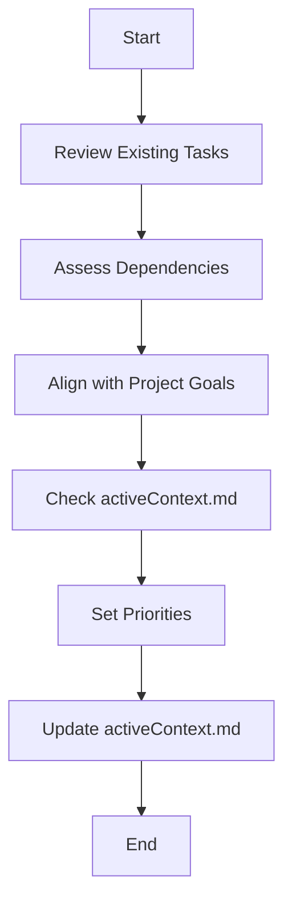

# **Cline Recursive Chain-of-Thought System (CRCT) - Strategy Plugin**

**This Plugin provides detailed instructions and procedures for the Strategy phase of the CRCT system. It should be used in conjunction with the Core System Prompt.**

---

## I. Entering and Exiting Strategy Phase

**Entering Strategy Phase:**
1. **`.clinerules` Check**: Always read `.clinerules` first. If `[LAST_ACTION_STATE]` shows `current_phase: "Strategy"`, proceed with these instructions.
2. **Transition from Set-up/Maintenance**: Enter after Set-up/Maintenance; `.clinerules` `next_phase` will be "Strategy".
3. **User Trigger**: Start a new session after Set-up/Maintenance or to resume strategy.

**Exiting Strategy Phase:**
1. **Completion Criteria:**
   - Instruction files for prioritized tasks are created with objectives, context, dependencies, and steps.
   - Tasks are prioritized and ready for execution.
   - Strategy objectives for the cycle are met.
2. **`.clinerules` Update (MUP):**
   ```
   last_action: "Completed Strategy Phase - Tasks Planned"
   current_phase: "Strategy"
   next_action: "Phase Complete - User Action Required"
   next_phase: "Execution"
   ```
3. **User Action**: After updating `.clinerules`, pause for user to trigger Execution phase via a new session. See Core System Prompt, Section III for a phase transition checklist.

---

## II. Loading Context for Strategy

**Action**: Load context to guide strategy.
**Procedure:**
- Load core files: `.clinerules`, `projectbrief.md`, `productContext.md`, `activeContext.md`, `dependency_tracker.md`, `changelog.md`, `doc_tracker.md`.
- Review `activeContext.md` for current state, decisions, and priorities.
- Check `dependency_tracker.md` and `doc_tracker.md` for module and documentation dependencies.
- Revisit `projectbrief.md` and `productContext.md` to align with project scope and purpose.
- Examine `.clinerules` [LEARNING_JOURNAL] for past insights influencing strategy.

---

## III. Creating New Task Instruction Files

**Action**: Create `*_instructions.txt` files for tasks/subtasks.
**Procedure:**
1. **Identify Task/Subtask**: Use `projectbrief.md`, `productContext.md`, `activeContext.md`, and project state to select tasks, such as:
   - Breaking down `projectbrief.md` objectives.
   - Addressing `activeContext.md` priorities.
   - Targeting `dependency_tracker.md` modules.
2. **Choose Task Name and Location:**
   - **Task**: Create `{task_name}_instructions.txt` in a new directory if needed (e.g., `strategy_tasks/`).
   - **Subtask**: Place `{subtask_name}_instructions.txt` in a parent task subdirectory.
   - **Module-Level**: Use or create `{module_dir}/{module_dir}_main_instructions.txt` (see Set-up/Maintenance Plugin, Section VI).
3. **Populate Instruction File Sections:**
   - Set title: `# {Task Name} Instructions`.
   - Define objective: Clearly state purpose and goals.
   - Provide context: Include background and constraints, referencing files.
   - List dependencies: Use hierarchical keys from `dependency_tracker.md`, `doc_tracker.md`, and mini-trackers.
   - Outline steps: Break into actionable increments.
   - Specify output: Describe deliverables.
   - Add notes: Note challenges or considerations.
   - Include mini-tracker (module files only): Add placeholder using `generate-keys`:
     ```
     python -m cline_utils.dependency_system.dependency_processor generate-keys utils --output utils/utils_main_instructions.txt --tracker_type mini
     ```
     *Replace `utils` with the actual module directory from `[CODE_ROOT_DIRECTORIES]` in `.clinerules`.*
   - Example Instruction File:
     ```
     # DataProcessing Instructions

     ## Objective
     Process raw data into a structured format.

     ## Context
     Uses data from `raw_data.csv` in `data/`.

     ## Dependencies
     - 1A1 (`data/raw_data.csv`)
     - 1B (`utils/data_utils.py`)

     ## Steps
     1. Read `raw_data.csv` using `data_utils.py`.
     2. Clean data (remove nulls).
     3. Write to `processed_data.csv`.

     ## Expected Output
     - `data/processed_data.csv`

     ## Notes
     - Handle large files carefully.
     ```
4. **MUP**: Follow Core MUP and Section V additions after creating files.

---

## IV. Prioritizing Tasks and Subtasks

**Action**: Determine task/subtask priority and order.
**Procedure:**
1. **Review Existing Tasks**: Check incomplete instruction files in module or task directories.
2. **Assess Dependencies**: Use `dependency_tracker.md`, `doc_tracker.md`, and mini-trackers to prioritize prerequisite tasks.
3. **Consider Project Goals**: Align with `projectbrief.md` objectives, prioritizing key contributions.
4. **Review `activeContext.md`**: Factor in recent priorities, issues, or feedback.
5. **Update `activeContext.md`**: Record priorities and reasoning.

### IV.1 Prioritization Flowchart


---

## V. Strategy Plugin - Mandatory Update Protocol (MUP) Additions

After Core MUP steps:
1. **Update Instruction Files**: Save new or modified instruction files.
2. **Update `activeContext.md` with Strategy Outcomes:**
   - Summarize planned tasks.
   - List new instruction file locations and names.
   - Document priorities and reasoning (from Section IV).
3. **Update `.clinerules` [LAST_ACTION_STATE]:**
   ```
   ---CLINE_RULES_START---
   [LAST_ACTION_STATE]
   last_action: "Completed Strategy Phase - Tasks Planned"
   current_phase: "Strategy"
   next_action: "Phase Complete - User Action Required"
   next_phase: "Execution"
   [LEARNING_JOURNAL]
   # Planned tasks on March 08, 2025: DataProcessing, ModelTraining.
   ---CLINE_RULES_END---
   ```

---

## VI. Quick Reference
- **Actions:**
  - Create instruction files: Define tasks/subtasks.
  - Prioritize tasks: Assess dependencies and goals.
- **Files:**
  - `projectbrief.md`: Guides objectives.
  - `activeContext.md`: Tracks state and priorities.
  - `dependency_tracker.md`: Lists dependencies.
- **MUP Additions:** Update instruction files, `activeContext.md`, and `.clinerules`.
